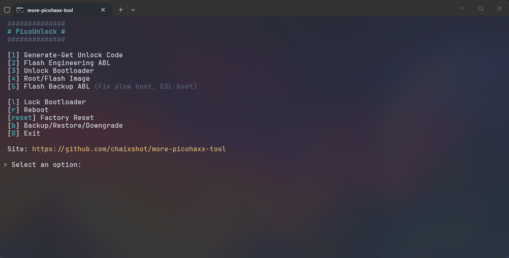

# Pico 3/4 Bootloader Unlock & Root Tool & Data Backup & Downgrade

 

This repository contains a comprehensive set of tools and scripts for unlock Bootloader, rooting and full backup the **Pico 4**, **Pico 4 Pro**, and **Pico Neo 3** VR headsets.

### [Download Tool](https://github.com/chaixshot/more-picohaxx-tool/releases/latest) and run `picounlock.bat` to begin

> [!CAUTION]
> Unlocking the Bootloader will **WIPE ALL USER DATA** (Factory Reset).
> It is highly recommended to backup **User Personal Data** before starting.
>
>**Risk**: Flashing firmware carries inherent risks. While this method is tested, proceed at own risk.

## Status

* **Pico 4**: Confirmed working.
* **Pico 4 Pro**: Confirmed working.
* **Pico Neo 3**: Confirmed working.

## Prerequisites

* **Windows PC**: The automation script is written in [PowerShell](https://github.com/powershell/powershell).
* **PowerShell Execution**: If script can not run, follow [ps-enabling-exec-scripts](https://github.com/whonion/ps-enabling-exec-scripts) guide
* **Pico Headset**: Pico 4, Pico 4 Pro, or Pico Neo 3 with [USB Debug](#usb-debug) enabled.

## Backup

This tool includes a built-in **Backup** suite to protect user data from **Factory Reset** and **Headset Bricking**.
> Uses the folder `./backup` to store data by default.

### Backup Modes

* **Physical Binary Dump (LUNs)**
  * Sector-by-sector clone of physical drives (LUN 0-5).
  * Best for unbricking, GPT repair, and low-level recovery.
  * Excludes `userdata`.
* **User Personal Data (UserData)**
  * Backup only the `userdata` partition.
  * Includes all apps, games, save files, photos, settings, and internal storage files.
* **System Partition Dump (Partitions)**
  * Individual file per system partition (`boot`, `abl`, `system`, etc.).
  * Best for general firmware backup or modding.
  * Excludes `userdata`.

### Backup Features

* **Custom Backup Folder**: Specify folder path when starting a backup to save space on system drive or organize files manually.
* **LZX Compression**: Optional folder compression for backups using Windows native `compact.exe`. Reduces backup size by up to **60%** while keeping files directly accessible with negligible CPU impact.
* **EDL Integration**: Automates the complex **EDL** workflow using the provided `QFILHelper`.

## Restore

> Scan default folder `./backup` to create menu.

* **Backup Selector**: Select between different backup sets using the menu.
* **Custom Restore Folder**: Paste a backup folder path directly into the menu. Automatically detects the backup type (`LUNs`, `UserData`, `Partitions`, or `Downgrade`) based on the files inside.

## Unlock Bootloader

1. **Perform Backup**: Perform **User Personal Data** backup before proceeding, as unlocking will wipe headset user data.
1. **Get Chip ID**: Acquire headset `serial_number` (Chip ID) via `adb` (from `/sys/devices/soc0/serial_number`).
1. **Generate Token**: Use `more-picohaxx.py` to generate `fastboot oem picoXXXXXXXX unlock` unlock command.
1. **Flash engineering ABL**: Flash the old `abl` and `devinfo` via EDL.
    * **Firehose Selection**: Choose the correct firehose based on headset hardware:
        * **Pico 4 / Pico 4 Enterprise / Pico Neo 3**: Select **DDR 4** (Standard firehose).
        * **Pico 4 Pro**: Select **DDR 5** (Lite firehose).
1. **Fastboot Unlock**: Issue the generated command from **Generate Token**, followed by:
    * `fastboot flashing unlock_critical`
    * `fastboot flashing unlock`
    * `fastboot oem setenforce 0`
1. **Reboot Bootloader**: Confirm unlock state is persistence after reboot.
   * If it isn't stay unlocked, **repeat the steps**. This is expected behavior; don't be afraid to try again.
1. **Factory Reset**: Perform factory reset via recovery to wipe user data if necessary.
1. **Root with Magisk**: Flash Magisk patched `boot.img` via unlocked fastboot to get superuser access.
1. **Flash Backup ABL**: Flash original firmware `abl` image to restore boot capability.
1. **Restore Userdata**: Restore backed-up user data

## Root with Magisk

The tool includes an automated workflow to root headset directly from Windows:

1. **Pull Boot Image**: Pull firmware `boot.img` directly from headset via EDL mode.
1. **Install Magisk**: Installs `Magisk4Pico.apk` directly to headset.
1. **Native Windows Patching**: Automatically patches `boot.img` on Windows using the integrated **MagiskBoot** tool without needing manual patching on the headset.
1. **Flash Patched Image**: Flashes `magisk_patched.img` via `fastboot`.
1. **Verify Root**: Automatically checks and confirms superuser access via `adb`.

### Root Tweak

Recommend [Magisk](https://github.com/topjohnwu/magisk) modules and [Xposed Framework](https://github.com/JingMatrix/Vector) apps

* Core framework [Vector](https://github.com/JingMatrix/Vector) and [NyaZygisk](https://github.com/HSSkyBoy/NyaZygisk)
* Magisk modules: [pico-screenshot-hires](https://github.com/hhhbwc/pico-screenshot-hires) | [pico4-aggressive-fan](https://github.com/hhhbwc/pico4-aggressive-fan)
* Xposed modules: [PicoDockShortcut](https://github.com/chaixshot/PicoDockShortcut) | [Pico3dResolution](https://github.com/chaixshot/Pico3dResolution) | [PicoNeverSleep](https://github.com/chaixshot/PicoNeverSleep) | [Pico-4-IME-Unlock](https://github.com/Skyrimus/Pico-4-IME-Unlock) | [PicoFanControl](https://github.com/Seva167/PicoFanControl) | [pico-resfix](https://github.com/hhhbwc/pico-resfix) | [pico4-winlimit](https://github.com/hhhbwc/pico4-winlimit) | [PICO-Custom-Wallpaper](https://github.com/hhhbwc/PICO-Custom-Wallpaper) | [pico4-sleep-mode](https://github.com/hhhbwc/pico4-sleep-mode) | [pico4-quest3-swap](https://github.com/hhhbwc/pico4-quest3-swap)
* Other: [PICO-4-GPU-Overclocking](https://github.com/hhhbwc/PICO-4-GPU-Overclocking) | [pico4_120hz](https://github.com/hhhbwc/pico4_120hz)

## Flash Custom Image

When the bootloader is unlocked, the device can flash a custom image via EDL mode. This will help with stable development from Engineering ABL unstable boot.

## Rollback OS

Full firmware downgrades and dynamic partition processing, allowing the device to roll back to any firmware version.

* **Downgrade**: Introduction to using the legacy downgrade 5.6.0 partition file set.
* **Firmware Downloader:** Built-in menu to get firmware version download links.
* **Archive Extraction:** Automatically extracts compressed firmware packages (`.zip`, `.rar`, `.7z`).
* **Automated EDL Flashing:** Safely transitions the device into EDL mode and flashes system and firmware images sequentially.

> [!WARNING]
> Downgrading OS versions introduces encryption (`keystore`) and SELinux mismatch risks.
> Depending on the target version, a factory reset may be required to prevent non-bootable states or bootloops.
> Always perform a **User Personal Data** backup before proceed.

## Troubleshooting & Tips

### Unlock Persistence

If `fastboot oem device-info` shows the headset as locked after the first attempt, **repeat the unlock commands**. It is known that the unlock bits (written to protected RPMB storage) might not "stick" immediately.

### Slow Boot or EDL Boot

Using the **Engineering ABL** can cause issues like slower boot or unexpectedly entering EDL mode. To fix this:

1. **Unlock and Root** the headset successfully first.
1. Use the **"Flash backup ABL"** option in the script menu. This restores firmware `abl` partition.
1. Because the unlock state is stored in the **RPMB**, headset will remain unlocked even with the firmware ABL.

> [!NOTE]
> This will return SELinux to Enforcing. Use a Magisk module [selinux_permissive](https://github.com/evdenis/selinux_permissive) to maintain permissive mode if the setup requires it.

### USB Connectivity

* Use a high-quality USB-C cable.
* If EDL mode is unstable, try a USB 2.0 port.

### USB Debug

1. Enter **Pico OS** settings menu
1. Go to **General** > **About**
1. Tap **Software version** 7 times quickly until the **Developer** tab appears
1. Go to **Developer** tab and enable the **USB Debug** option

### Manual Boot

* System: Hold <kbd>Power</kbd> until Pico logo shows up.
* [Recovery mode](https://wikipedia.org/wiki/Android_recovery_mode) (Dead robot): Hold <kbd>Vol Up</kbd> + <kbd>Power</kbd> until dead robot shows up.
* [Fastboot mode](https://wikipedia.org/wiki/Fastboot) (Left eye menu): Hold <kbd>Vol Down</kbd> + <kbd>Power</kbd> until menu shows up.
* [EDL mode](https://wikipedia.org/wiki/Qualcomm_EDL_mode) (Black screen): Hold <kbd>Vol Up</kbd> + <kbd>Vol Down</kbd> + <kbd>Power</kbd>.

### Recovery Mode

1. Robot shows up with "No command." message as recovery mode.
1. In recovery mode, hold <kbd>Power</kbd> first then press <kbd>Vol Up</kbd> to access the menu.
1. Use <kbd>Vol Up</kbd> and <kbd>Vol Down</kbd> to navigate, and press <kbd>Power</kbd> to select.

### Undo

This tool includes Unroot and lock Bootloader

> [!NOTE]
> Unrooting does not lock the Bootloader. To lock the Bootloader, use the **Lock Bootloader** option in the menu.

> [!CAUTION]
> Locking the Bootloader will **WIPE ALL USER DATA** (Factory Reset).
> It is highly recommended to backup **User Personal Data** before starting.

## Key Components

* `picounlock.bat`: A convenient wrapper to run the script with Administrator privileges.
* `picounlock.ps1`: The main automation script (PowerShell).
* `modules/`: Contains modularized logic for `picounlock.ps1`.
* `more-picohaxx.py`: The core logic for deriving the unlock code from the headset serial number.
* `tools/`: Android platform tools, and `edl-ng`.
* `tools/driver`: Qualcomm usb driver.
* `tools/engineering`: Engineering ABL & Devinfo.
* `tools/firehoses`: EDL firehose flashing protocol .
* `tools/magisk`: Rooting the headset after unlocking.
* `logs`: Everything that is written on the console.
* `backup`: Default headset backup which is `abl`, `partitions`, and `boot.img`.

## Credits

* **[typlo](https://github.com/264312431)**: Discovery of the bootloader bypass method and original root exploit.
* **[Fallen Angel](https://github.com/FallenAngel-PP)**: Fearless testing, validation, and development of Magisk4Pico.
* **[QFILHelper](https://github.com/Beliathal/QFILHelper)**: Guideline flashing manager.
* **[edl-ng](https://github.com/strongtz/edl-ng)**: Modern Qualcomm Emergency Download (EDL) CLI tool.
* **[magiskboot](https://github.com/Pranav-Talmale/magiskboot)**: Windows port of Magisk's boot image patching utility.
* **[7zip](https://github.com/ip7z/7zip)**: Archive extraction utility.
* **[brotli](https://github.com/google/brotli)**: Brotli compression and decompression binaries.
* **[aosp15_partition_tools](https://github.com/Rprop/aosp15_partition_tools)**: Tools for building and manipulating `super.img` dynamic partitions.

---
*For more technical details on the bypass mechanism, refer to the comments in `more-picohaxx.py`.*
